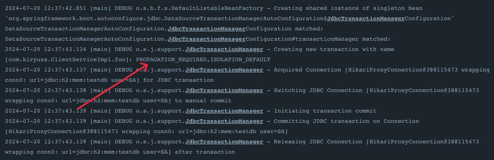

# Spring Interview: well-known question about @Transactional

How many transactions will be used?
```Kotlin
open class ClientServiceImpl : ClientService {

    @Transactional(propagation = Propagation.REQUIRED)
    override fun foo() {
        logger.debug("Inside foo(): before calling bar()")
        bar()
        logger.debug("Inside foo(): bar() was called")
    }

    @Transactional(propagation = Propagation.REQUIRES_NEW)
    override fun bar() {
        logger.debug("Inside bar()")
    }

    companion object {
        val logger: Logger = LoggerFactory.getLogger(ClientServiceImpl::class.java)
    }
}
```

Only one:


